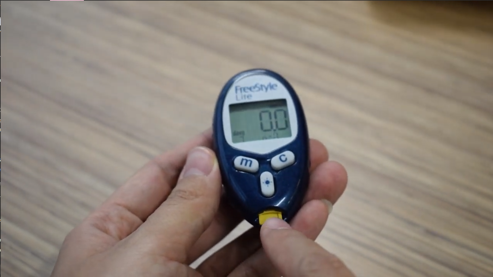

# Health-Informatics-Videos
A selection of informational videos discussing aspects of technology in Health. All videos are edited through Adobe Premiere Pro. Control & click or cmd & click any of the images or links to open each video in a new tab.

This <a href = "https://youtu.be/i0vSxs4PIUo">HIM video</a> was created during August 2020 for a change management class where I discuss what my field of study means to me. Recorded through my laptop web camera.

In Information Technology I for December 2019, my group and I were tasked to take apart a medical device and explain it in full, from history, to everyday use, and its technical inner workings; our device of choice was a Freestyle Lite blood glucose monitor. This <a href="https://youtu.be/exXgOQmR8s4">video</a> was taken with my Nikon D5300.

Last but not least, for our first Health Informatics class, my group and I were tasked to explain a case study on physician compliance to implementation of new medical alert program through this <a href="https://youtu.be/9R90SpnM-AQ">video here</a>. All footage was shot through rented equipment from Conestoga Media Labs and lav Mics.
